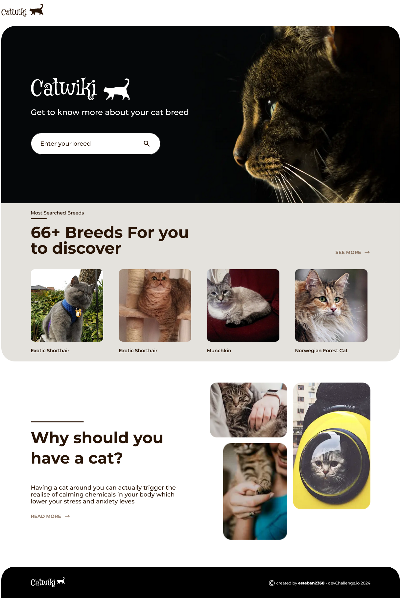

# Dev challenges - CatWiki

This is a solution to the [CatWiki page](https://legacy.devchallenges.io/challenges/f4NJ53rcfgrP6sBMD2jt). devChallenges challenges help you improve your coding skills by building realistic projects. 

## Overview

### Links

- Solution URL: [Code solution](https://github.com/esteban2368/wiki-cat-challenge)
- Live Site URL: [Live site](https://wiki-cat-challenge.vercel.app/)

### Built with

- Semantic HTML5 markup
- Modules CSS
- Flexbox
- [Typescript](https://www.typescriptlang.org/) - JavaScript with syntax for types 
- [NextJS](https://nextjs.org/) - React framework 
- [ReactJS](https://react.dev/) - Library javascript for web user interfaces
- [Google Symbols](https://fonts.google.com/icons) - Font icons
- [Tailwind](https://tailwindui.com/) - Framework CSS
